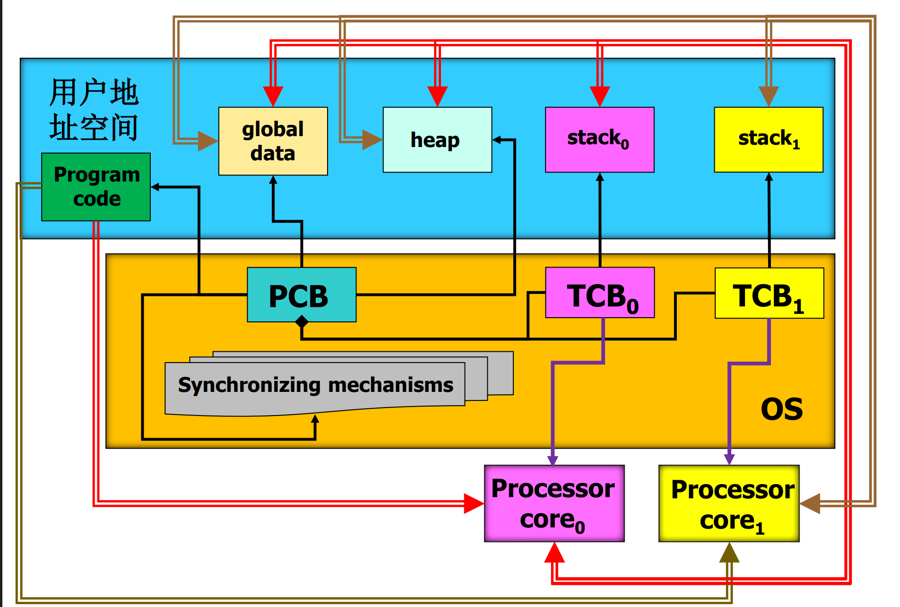
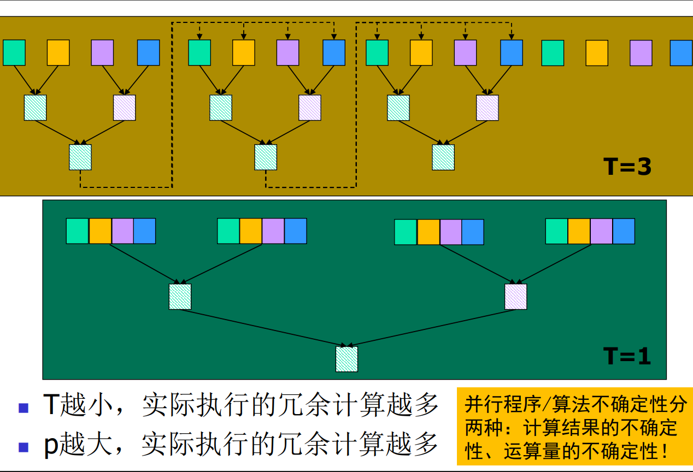
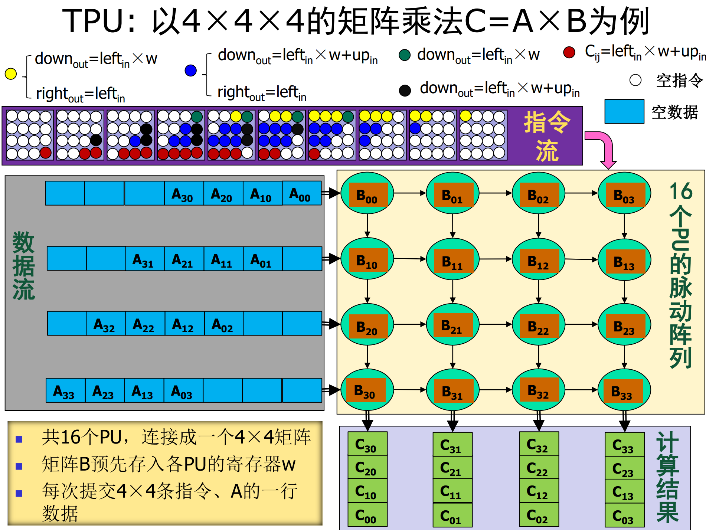
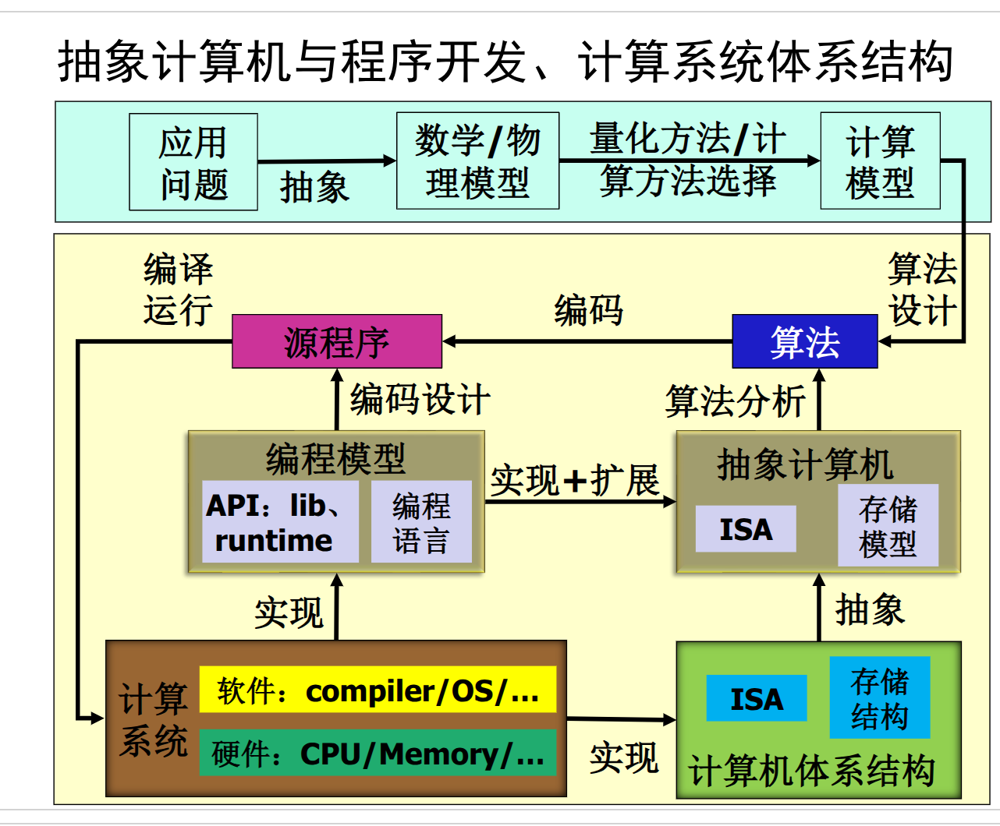
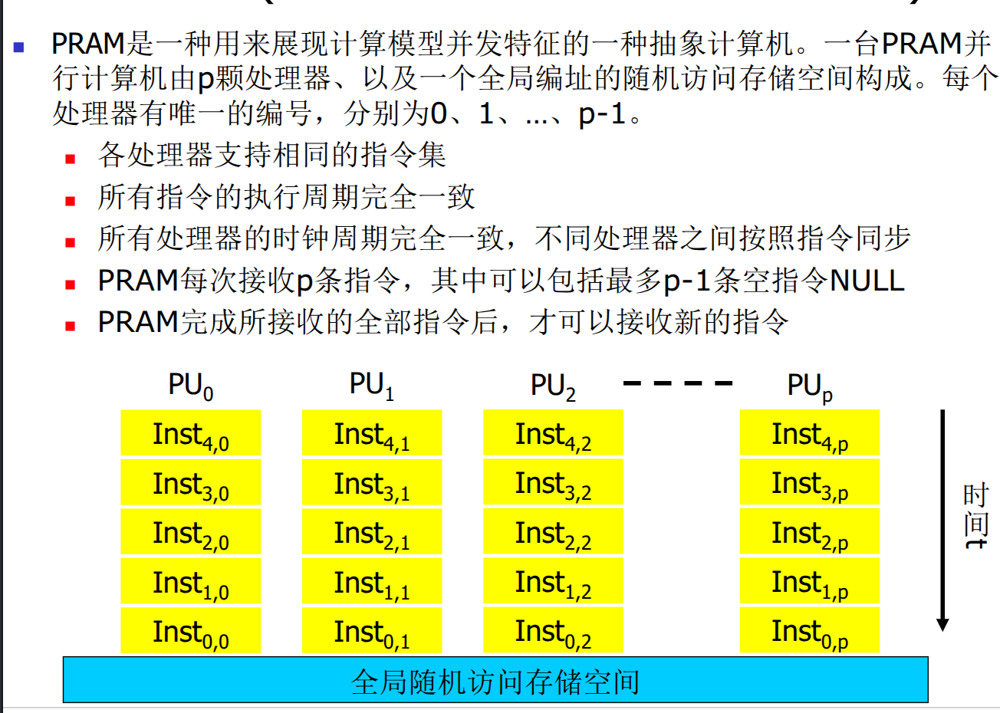
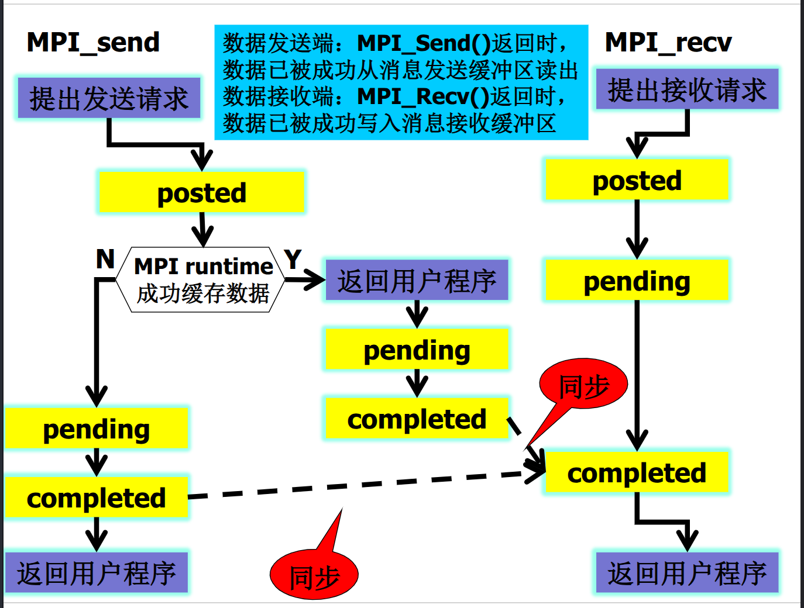
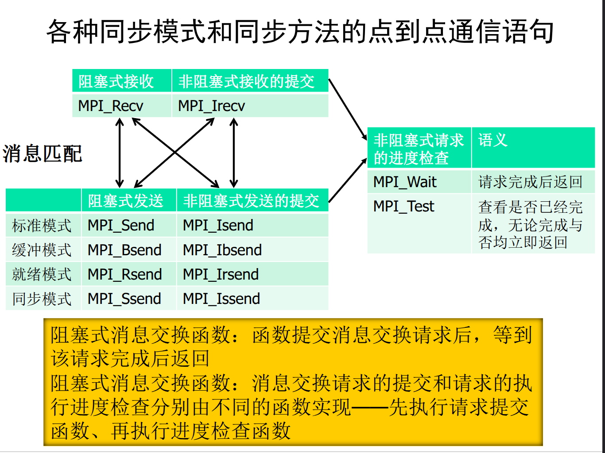
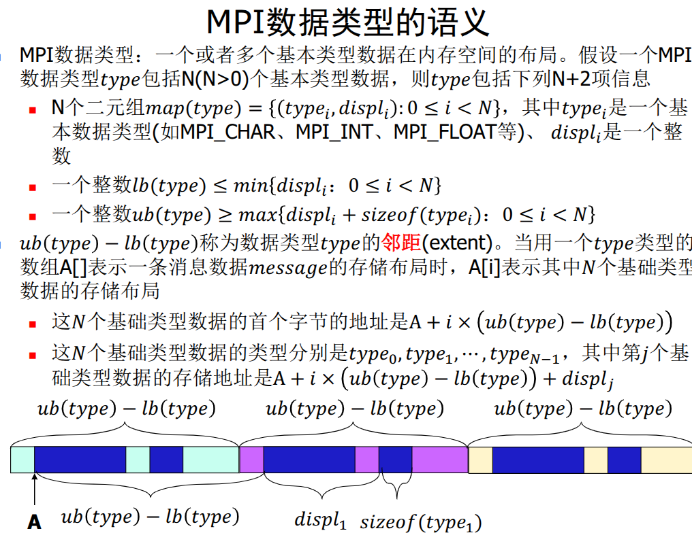

# 并行计算

> [!note !tip !important !warning !caution ]

## Introduction

> 正确而高效.

浮点数 (FP8 E4M2, FP8 E5M2, FP16, BF16)

风险在于有向下溢出的风险.

> [!WARNING]
> 浮点数运算不满足结合律

- 适配不同数据
- 适配不同计算技术
- 复杂性优化
- 数据访问效率优化
- 利用率优化

区分:
- 效率Efficiency : 使用的计算量
- 性能Performance: 使用的时间 
- 成本Cost: 求解问题所消耗的资源

区分
- 计算模型: 其量化表示, 数学公式
- 算法: 用计算资源求解的步骤, 伪代码 
- 算法编码: 编码计算机模型, 实际实现

普适计算范式
- 串行计算 以处理器为中心
- 并行计算 以数据为中心

时间资源
- 壁挂时间 wall time 
- 处理器时间 processor time

超标量技术: 多发射指令, 对计算模型的数据处理顺序化.

有些是可以并行运行的(无前缀依赖)

超长指令字技术: IA64 处理器由3条指令组成超指令

程序自动并行化技术

OpenMP, MPI 

## 并行计算体系结构

计算机体系结构(Computer Architecture, CA) 是描述计算系统计算, 组织结构以及实现的一组**规则**和方法.

核函数: 

编写核函数

指令： 计算系统中软件与硬件的接口 (如SSE指令)

Cuda中,kernel函数只能由GPU核心调用.

进程: 程序是以进程的形式分配的资源. 

### 线程进程

用户地址空间: 
- 程序Program code
- 全局变量global data: 进程内所有线程共享, 写程序时已经确定的
- 堆heap: 用于动态分配内存, 临时变量. 写程序时不确定的
- 栈stack: 用于函数调用

操作系统: 
- 核心 <--TCB 线程管理 --> 每一个线程需要一个栈
- PCB 进程管理 --> 每一个进程需要一个堆

### 从算法/程序性能

体系结构会影响算法的设计: 多个核心时会根据任务的**分解方案**影响算法

会影响程序的性能

异步性是影响程序设计的计算系统关键特征: **部分程序呈现不确定性**

也会有性能不确定.

- 基于分治策略的分阶段模型：将数组均分为$(2^p)*T$ 个片段，每个片段包括 $size=N/((2^p)*T)$ 个连续的元素，每阶段处理(2^p)个片段
- 每一阶段查找处理(2^p)个片段，若未找到则继续下一阶段
- 在每个片段内部，任然按照递推模型消除其中的冗余计算

p是每个阶段处理的片度数, T=3时p=1, T=1时p=2, T就是分为多少片, 处理器每阶段处理完(2^p)个片段后再去同步.

T越大,切的越碎, 冗余计算少; p越大, 冗余计算越多

### 并行程序的接口

- 超标量技术: 多发射指令, 对计算模型的数据处理顺序化.
- 向量计算技术: 用向量指令
- 超长指令字技术: IA64 处理器由3条指令组成超指令
- 多核技术: 创建多线程/多进程
- 流式多处理器: 同构多线程 SIMT
- Multiprocessor: 多处理器
- Muiticomputer: 多计算器

flynn分类法
|SISD <\n> Single Instruction Single Data|SIMD <\n> Single Instruction Multiple Data|
|--------------------------------|---------------------------------------|
|MISD <\n> Multiple Instruction Single Data|MIMD <\n> Multiple Instruction Multiple Data|

从软件访问硬件的接口看体系结构

- SISD: 单指令单数据流, 传统计算机, 但是如果有超标量技术, 可以有多个指令并行
- SIMD: 单指令多数据流, 向量计算机, 有多个PU, 同一时刻执行同一指令. (CELL)
- MISD: 多指令单数据流, 少见. google TPU的4*4矩阵乘法
- MIMD: 多指令多数据流, 多处理器 常见的并行计算机都在这里

SIMT是SIMD的一种拓展, 同一时刻它们各自所执行指令的语义相同、分别处理不同的数据，每条指令分别编码被处理数据的地址. 多线程, 但是执行的指令完全一致, 所以指令解码前的过程可以共用, 而且好处是是同步的.

算法可移植: 对计算机进行代码抽象

## 并行计算模型

抽象计算机 abstract machine, 设计问题时对计算系统功能的基本假设和性能特征的参数化描述：
- 计算资源 & 指令集
- 计算资源之间的数据交换极致
- 存储模型，编址规则、访存机制

PRAM模型: 并行随机存取存储器模型 Parallel Random Access Machine

对于抽象计算机来说，分配给每个处理器的任务分解方案要保证**原子性**：任务开始执行之后，其执行进度、计算结果不受其它任务执行进度或者结果的影响。

线程是主机上的基本分解单位。

### PRAM模型

分为3类7种：
- EREW: Exclusive Read Exclusive Write 每个指令周期上每个存储单元只能被一个处理器读或写
- CREW: Concurrent Read Exclusive Write 每个指令周期上每个存储单元可以被多个处理器读, 但只能被一个处理器写 *可能会有读冲突，影响程序性能* 不共享cache的时候会有数据访问延迟.
- CRCW: Concurrent Read Concurrent Write 每个指令周期上每个存储单元可以被多个处理器读或写   *既有读冲突, 也有写冲突*
  - weak: 发生写冲突, 但是写入的值都是0(常量,编码阶段就有了), 没有冲突成本(只用交换信号, 告诉其他处理器在哪里读)
  - common-mode: 发生写冲突, 但是写入的值都是相同的, 但是之前没有定义, 所以需要将值传递出来, 以后其他处理器可以读 (需要交换值, 需要把值传递出来)
  - arbitrary-winner: 发生写冲突, 写入的值不一样, 但是只要有一个处理器成功写入就行, 任何值都符合计算模型要求. 不保证计算结果相同
  - priority(调试常用): 和 arbitrary-winner 类似, 但是有优先级, 优先级高的(编号最大)处理器写入成功. 保证结果可复现. 需要等到都计算结束了才写. 
  - strong: 保留最大值. 需要计算结束后还对所有写入值进行比较, 计算成本高.

> [!NOTE]
> weak 和 common-mode的区别: 比如德国和中国是两个处理器. 
> 对weak来说, 德国只需要告诉中国如何生产, 中国自己就利用自己的资源生产了.
> 对common-mode来说, 德国需要把生产的机器发给中国, 中国才能使用.

### 资源利用率

负载均衡: 执行NULL的/总指令
局部性: 数据访问的局部性, 同一指令周期: 各指令访问的数据是否连续. 相邻指令周期: 被访问的数据是否连续.

### BSP模型

BSP模型: Bulk Synchronous Parallel Model

- 每个处理器的存储空间分别独立编址
- 每个处理器只能读、写本地的存储空间
- 任意两个处理器之间可以通过网络交换各自的本地存储空间数据
- 任意一个处理器可以与其它全部处理器进行集体同步
- 不同处理器的指令周期、时钟周期都可以不同

### 并行编程语言

并行编程语言的基本构件
- 数据处理语句：处理器执行核心的编程API，用于任务的实现
- 表达数据处理并行性的基本机制
- 数据存储模型与访问机制
- 任务分解和分配机制
- 处理器核心之间的同步和数据交换机制

SPMD: Single Program Multiple Data
MPMD: Multiple Program Multiple Data

## MPI

通信密集型计算

MPI_Send, 在数据发送后，消息数据已经从发送方取出
MPI_Recv, 在数据接收后，消息数据已经存入接收方的存储

这意味着这算是一次同步

这种通信是阻塞的(blocking)

后续扩展到了非阻塞通信(non-blocking communication)MPI_Isend, MPI_Irecv

发送方：函数返回时，MPI已经成功的从用户程序空间取走了消息。不同模式，对网络系统的可用容量和接收方的执行进度有不同的预期

◼ 标准模式：MPI_Send。对接收方的进度无要求，网络系统有足够的容量完成被发送数据的传输

◼ 缓冲模式：MPI_Bsend。对接收方的进度、网络系统的容量均无要求，用户程序已为消息发送提供了足够大的额外缓存

给MPI runtime 说这一块空间buffer交给runtime管理，不会对其进行读写。runtime在接收方接收时才把这部分发出去。

MPI_Buffer_attach(IN buffer,IN size):在用户空间为MPI runtime提供一个
buffer，每个进程只能有一个这样的buffer。

◼ 同步模式：MPI_Ssend。函数返回时，接收方已经提交了接收请求，隐含网络系统有足够的容量完成被发送数据的传输

当接收方执行到recv时，告诉发送方在接收了。

◼ 就绪模式：MPI_Rsend。函数执行前，接收方已经提交了接收请求，隐含网络系统的容量无要求

配合MPI_Irecv使用， 当接收方的接收空间已经准备好时，发送方才发送数据

接收方：函数返回时，MPI已经成功地将消息数据存储到了用户程序空间

◼ MPI_Recv

## MPI并行程序的评价

模型设计--> 算法设计--> 程序编码--> 计算系统实现--> 程序运行--> 结果分析

程序输出的数值是否合理（不追求完全精确）

- 正确性 correctness
- 性能 performance
- 伸缩性 scalability 随着计算系统规模的扩大，程序性能提升的能力
- 确定性 determinacy

加速比（Speedup）S(p) = T(1) / T(p)

Amdahl定律: S(p) <= 1/(f + (1-f)/p) < 1/f
其中f为串行部分占总计算量的比例, Amdahl定律说明了串行部分对并行加速比的限制作用, 在模型设计。

点到点通信语义：
- order: 同一个发送者对同一个接收者发送的多条消息，接收者按发送顺序接收
- progress： 消息传递进度，一旦接收了发送者的接收请求，消息就会被传递
- fairness： 
- resource limitation

## MPI 计算资源管理

进程集：并行程序在执行并行算法时可以使用的计算和存储资源：有共同URI的一组进程。
进程组： 当前并行程序实际使用的计算和存储资源。
组内通信子： 并行算法实际执行的并行函数实例

### MPI 线程支持 thread level

MPI_THREAD_SINGLE: 单线程模型
MPI_THREAD_FUNNELED: 只有主线程可以调用MPI函数
MPI_THREAD_SERIALIZED: 多线程模型, 但是同一时刻只有一个线程可以调用MPI函数
MPI_THREAD_MULTIPLE: 多线程模型, 多个线程可以同时调用MPI函数

### MPI 通信子 communicator
MPI_INIT_THREADS
MPI_COMM_DUP : 基于组内通信子创建新的组内通信子，完全相同

MPI_COMM_SPAWN: 基于进程集创建新的组内通信子，可以指定进程数量和URI

## MPI 数据传输

### MPI 自定义 数据类型 创建
𝑚𝑎𝑝(𝑡𝑦𝑝𝑒1)={(double; 0), (char; 8)}
2. array_of_blocklengths[]=(2, 1, 3)
3. array_of_displacements[]=(0, 16, 26)
4. array_of_types[] = (MPI_FLOAT, type1, MPI_CHAR)
则MPI_Type_create_struct()生成𝑚𝑎𝑝(∗newtype)=
{(float, 0), (float, 4), (double, 16), (char, 24), (char, 26), (char, 27), (char, 28)}

组间通讯时, Alltoallw 可以实现不同进程间不同数据类型和数据量的通信. 不需要在组内通讯时使用.

MPI_Barrier(MPI_Comm comm) 程序调试时用